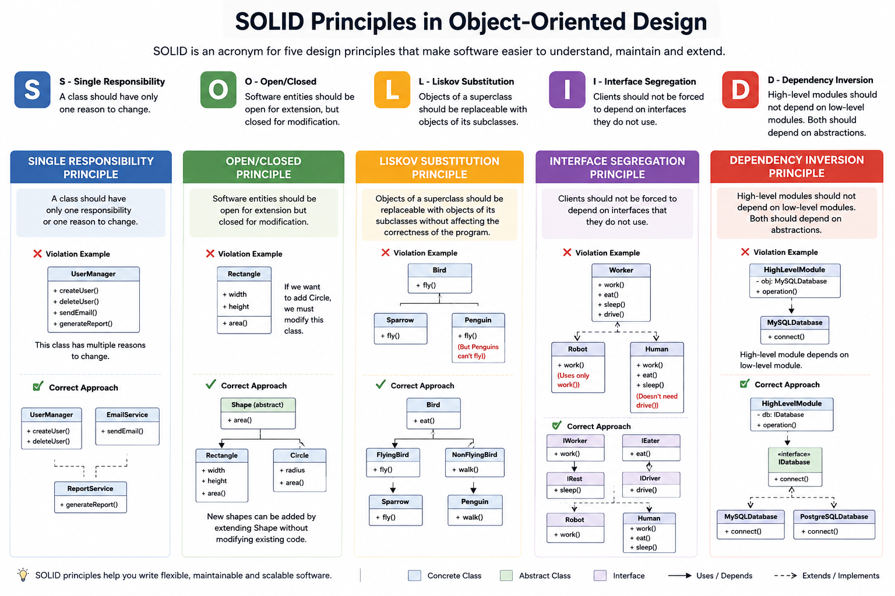

>UML (Unified Modeling Language) diagrams are the bllueprint of the sft. systems, providing visual represnetation of architecture, interaction and behavior. In another word we can say that UML is the gap between ideas and implementation. 
>
>Now we dive deep into essential UML  diagrams with practical examplex...
>
> ## Why UML diagram Matter
>- **Clarity:** Replace verbose description with intuitive visuals.
>- **Design Validation:** Identify flaws before coding begins.
>- **Documentation:** Serve as living artifacts for futture maintenance.
>- **Communication:** Align teams on system structure and behavior.
>
<p align="center">
  <a href="./img/UML-type.png">
    
  </a>
  <p align="center">
    <em>UML Diagram</em>
  </p>
</p>

We'll focus on the Class Diagram (structural) and Sequence Diagram (behavioral) — the most critical for system design interviews.

## Class Diagrams:

Class diagrams depict classes, attributes, methods, and relationships between objects.

**Anatomy of a Class**

<p align="center">
  <a href="./img/anatomy-of-a-class.png">
    
  </a>
  <p align="center">
    <em>Anatomy of a Class</em>
  </p>
</p>

- **Top Section:** Class Name — Student
- **Middle Section:** Attributes (Fields) — e.g., name, rollNumber, email, age, and cgpa, each with its data type and access modifier:
    - `+ Public`
    - `- Private`
    - `# Protected`
- **Bottom Section:** Methods (Behaviors) — e.g., enrollCourse(), updateEmail(), calculateCGPA(), isEligibleForPlacement(), and getStudentInfo(), including their parameters and return types...

## Class Associations

Relationships define how classes interact. Types of Associations are:
1) **Inheritance (Is-a Relationship)**
- Arrow: Solid line with a closed triangle
- Example: FullTimeEmployee is a Employee
<p align="center">
  <a href="./img/class-associations.png">
    
  </a>
  <p align="center">
    <em>Class Associations</em>
  </p>
</p>

2) **Composition (Strong Has-a)**
- Symbol: Filled diamond (◆). Parts cannot exist without the whole.
- Example: A `House` has `Room` and `Door`
<p align="center">
  <a href="./img/composition.png">
    
  </a>
  <p align="center">
    <em>Composition</em>
  </p>
</p>

3) **Aggregation (Weak Has-a)**
- Symbol: Hollow diamond (◇). Parts can exist independently.
- Example: A `Department` has a `Employee` and `Project` 
<p align="center">
  <a href="./img/Aggregation.png">
    
  </a>
  <p align="center">
    <em>Aggregation</em>
  </p>
</p>

4) **Simple Association**
- Symbol:Open arrow (→). Basic dependency.
- Example: `Teacher` teaches `Student`
<p align="center">
  <a href="./img/Simple-Association.png">
    
  </a>
  <p align="center">
    <em>Simple Association</em>
  </p>
</p>

## Sequence Diagrams: Dynamic Interactions

Sequence diagrams visualize object interactions over time, crucial for behavioral scenarios.
<p align="center">
  <a href="./img/Sequence-dg-entities.png">
    
  </a>
  <p align="center">
    <em>Core Components</em>
  </p>
</p>

- **Objects**: Rectangles
- **Lifeline**: Dashed vertical line.
- **Activation Bar**: Thin rectangle (when object is active).

`Messages:`
- **Synchronous:** Solid line + closed arrow ( waits for response).
- **Asynchronous:** Solid line + open arrow (doesn’t wait).
- **Return:** Dashed line (response).
- **Lost:** Message not received.
- **Found:** Message from an unknown source.

### ATM money withdrawal Example:
<p align="center">
  <a href="./img/ATM-Money-Withdrawl.png">
    
  </a>
  <p align="center">
    <em>ATM Money Withdrawal</em>
  </p>
</p>

## SOLID Princliples
The SOLID principles are five fundamental guidelines for writing maintainable, flexible and scalable software in Object-Oriented Programming.
<p align="center">
  <a href="./img/SOLID-Principles.png">
    
  </a>
  <p align="center">
    <em>SOLID Principles</em>
  </p>
</p>

### Benefits of SOLID Principles
- Reduce Complexity.
- Flexible Software.
- Easy to maintain.
- Helps us to write better code.
- Easy to Understand.
- Avoid Duplicate code.

## 1) Single Responsibility Principle (SRP)
A class should have only one reason to change, meaning it should have only one responsibility.
```python
class Employee:
  def __init__(self,name,salary):
    self.name = name
    self.salary = salary
  
  def calculate_salary(self):
    return self.salary
  
  def generate_payslip(self):
      # Logic to generate payslip
      print(f"Payslip for {self.name}")

  def save_to_database(self):
    # Logic to save employee to database
    print(f"Saving {self.name} to database")
```

**Problem:** `Employee` handles three different responsibilities:

- Employee data
- Payslip generation
- Database persistence

We can separate these responsibilities into different classes.

```python
class Employee:
    def __init__(self, name, salary):
        self.name = name
        self.salary = salary

class SalaryCalculator:
    def calculate(self, employee):
        # Logic to calculate salary
        return employee.salary

class PayslipGenerator:
    def generate(self, employee):
        # Logic to generate payslip
        print(f"Payslip for {employee.name}")

class EmployeeRepository:
    def save(self, employee):
        # Logic to save employee to database
        print(f"Saving {employee.name} to database")
```
So, if the database logic changes, only `EmployeeRepository` needs to change.
If the payslip format changes, only `PayslipGenerator` needs to change.

## 2) Open Closed Principle (OCP)
Software entities should be open for extension but closed for modification.In simple words, we should be able to add new functionality without changing existing, tested code.
```python
class PaymentProcessor:

    def pay(self, payment_type, amount):

        if payment_type == "credit_card":
            print(f"Paid ₹{amount} using Credit Card")

        elif payment_type == "paypal":
            print(f"Paid ₹{amount} using PayPal")
```
If we want to add UPI payment, we have to modify the existing `PaymentProcessor`
```python
elif payment_type == "upi":
    print(f"Paid ₹{amount} using UPI")
```
So, every new payment method requires modifying existing code.

**Problem:** The class is not closed for modification.
```python
from abc import ABC, abstractmethod

class Payment(ABC):

    @abstractmethod
    def pay(self, amount):
        pass

class CreditCardPayment(Payment):

    def pay(self, amount):
        print(f"Paid ₹{amount} using Credit Card")

class PayPalPayment(Payment):

    def pay(self, amount):
        print(f"Paid ₹{amount} using PayPal")

class PaymentProcessor:

    def process(self, payment, amount):
        payment.pay(amount)
```
New payment methods can be added by extending the system, without modifying existing classes.

That's the essence of OCP: Open for extension, Closed for modification.

## 3) Liskov Substitution Principle (LSP)
Objects of a superclass should be replaceable with objects of a subclass without affecting the correctness of the program.
```python
class Bird:

    def fly(self):
        print("Bird is flying")

class Sparrow(Bird):

    def fly(self):
        print("Sparrow is flying")

class Penguin(Bird):

    def fly(self):
        raise Exception("Penguins cannot fly")
```
***NOW***
```python
def make_bird_fly(bird):
    bird.fly()

make_bird_fly(Sparrow())   # Works
make_bird_fly(Penguin())   # Error
```
***Problem***

`Penguin` is a `Bird`, but it cannot behave like the parent `Bird` because `Bird` promises a `fly()` method.

Therefore, replacing `Bird` with `Penguin` breaks the program.
```python
class Bird:
    def eat(self):
        print("Bird is eating")

class FlyingBird(Bird):

    def fly(self):
        print("Bird is flying")

class Sparrow(FlyingBird):

    def fly(self):
        print("Sparrow is flying")

class Penguin(Bird):

    def eat(self):
        print("Penguin is eating")
```
***NOW***
```python
def make_bird_eat(bird):
    bird.eat()

make_bird_eat(Sparrow())   # Works
make_bird_eat(Penguin())   # Works
```
For flying birds:
```python
def make_fly(bird):
    bird.fly()

make_fly(Sparrow())   # Works
```

## 4) Interface Segregation Principle (ISP)

Clients should not be forced to implement interfaces they don’t use.
In simple words, instead of creating one large interface, create smaller, specific interfaces.
```python
from abc import ABC, abstractmethod

class Worker(ABC):

    @abstractmethod
    def work(self):
        pass

    @abstractmethod
    def eat(self):
        pass

class Robot(Worker):

    def work(self):
        print("Robot is working")

    def eat(self):
        raise Exception("Robot doesn't eat")
```
***Problem***

`Robot` needs only `work()`, but it is forced to implement `eat()`.

This violates ISP because the `Worker` interface contains methods that some clients don't need.
```python
from abc import ABC, abstractmethod

class Workable(ABC):

    @abstractmethod
    def work(self):
        pass

class Eatable(ABC):

    @abstractmethod
    def eat(self):
        pass

class Human(Workable, Eatable):

    def work(self):
        print("Human is working")

    def eat(self):
        print("Human is eating")

class Robot(Workable):

    def work(self):
        print("Robot is working")
```
`Robot` only depends on `Workable`, while `Human` can implement both.

## 5) Dependency Inversion Principle (DIP)
High-level modules should not depend on low-level modules. Both should depend on abstractions.
In simple words, instead of directly depending on a specific class, depend on an interface/abstraction.
```python
class MySQLDatabase:

    def save(self, data):
        print("Saving data to MySQL")

class OrderService:

    def __init__(self):
        self.database = MySQLDatabase()

    def save_order(self, order):
        self.database.save(order)
```
***Problem***

If we want to switch from MySQL to MongoDB, we have to modify OrderService.
The high-level class is tightly coupled to a low-level implementation.
```python
from abc import ABC, abstractmethod

class Database(ABC):

    @abstractmethod
    def save(self, data):
        pass

class MySQLDatabase(Database):

    def save(self, data):
        print("Saving data to MySQL")

class MongoDB(Database):

    def save(self, data):
        print("Saving data to MongoDB")

class OrderService:

    def __init__(self, database: Database):
        self.database = database

    def save_order(self, order):
        self.database.save(order)
```
Now we can inject any database:
```python
mysql = OrderService(MySQLDatabase())
mysql.save_order("Order 101")

mongo = OrderService(MongoDB())
mongo.save_order("Order 102")
```
`OrderService` depends on the `Database` abstraction, not on a specific database.