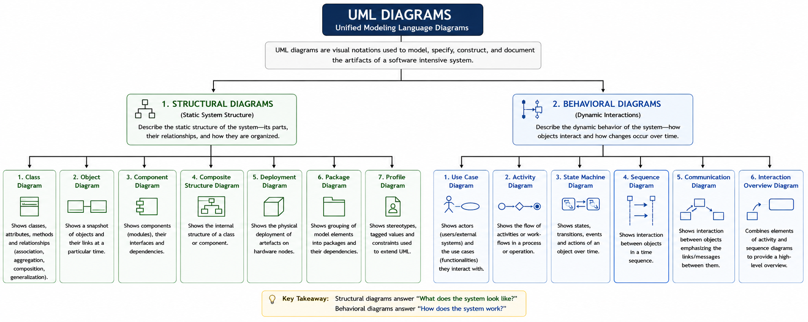
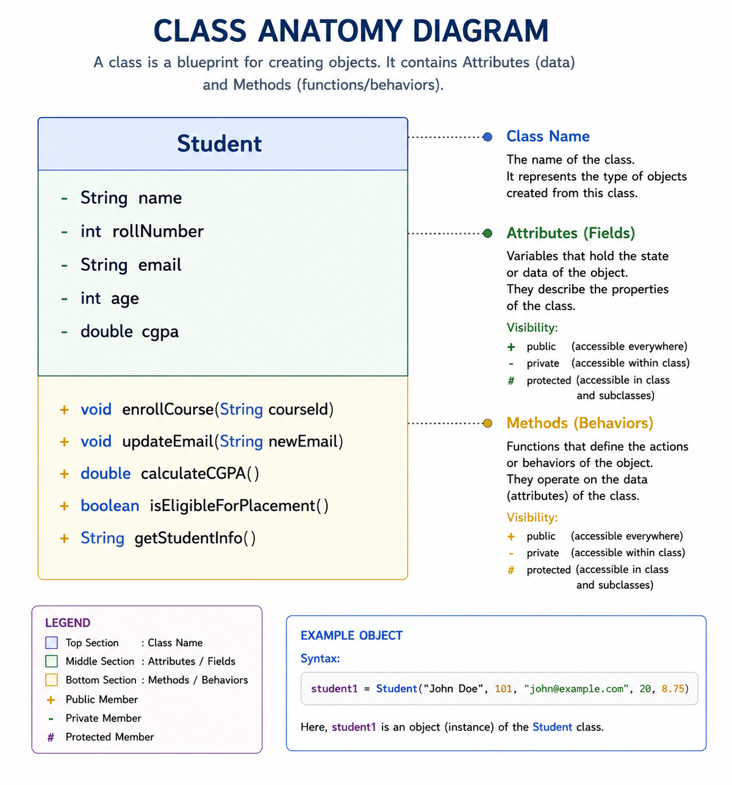

>UML (Unified Modeling Language) diagrams are the bllueprint of the sft. systems, providing visual represnetation of architecture, interaction and behavior. In another word we can say that UML is the gap between ideas and implementation. 
>
>Now we dive deep into essential UML  diagrams with practical examplex...
>
> ## Why UML diagram Matter
>- **Clarity:** Replace verbose description with intuitive visuals.
>- **Design Validation:** Identify flaws before coding begins.
>- **Documentation:** Serve as living artifacts for futture maintenance.
>- **Communication:** Align teams on system structure and behavior.
>

  
  

    <em>UML Diagram</em>
  

We'll focus on the Class Diagram (structural) and Sequence Diagram (behavioral) — the most critical for system design interviews.

## Class Diagrams:

Class diagrams depict classes, attributes, methods, and relationships between objects.

**Anatomy of a Class**

  
  

    <em>Anatomy of a Class</em>
  

- **Top Section:** Class Name — Student
- **Middle Section:** Attributes (Fields) — e.g., name, rollNumber, email, age, and cgpa, each with its data type and access modifier:
    - `+ Public`
    - `- Private`
    - `# Protected`
- **Bottom Section:** Methods (Behaviors) — e.g., enrollCourse(), updateEmail(), calculateCGPA(), isEligibleForPlacement(), and getStudentInfo(), including their parameters and return types...

