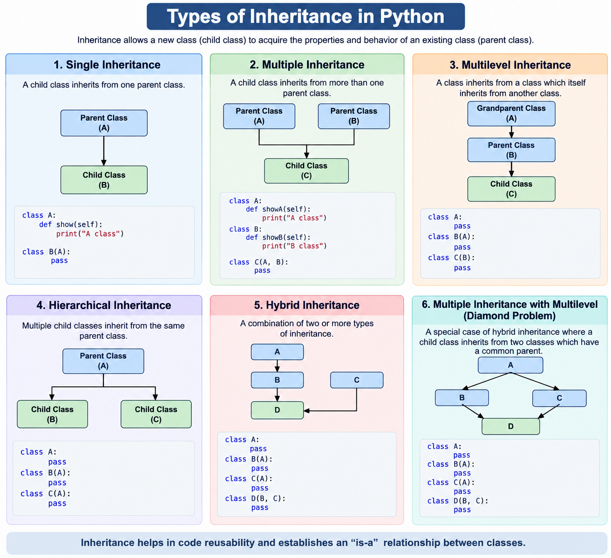
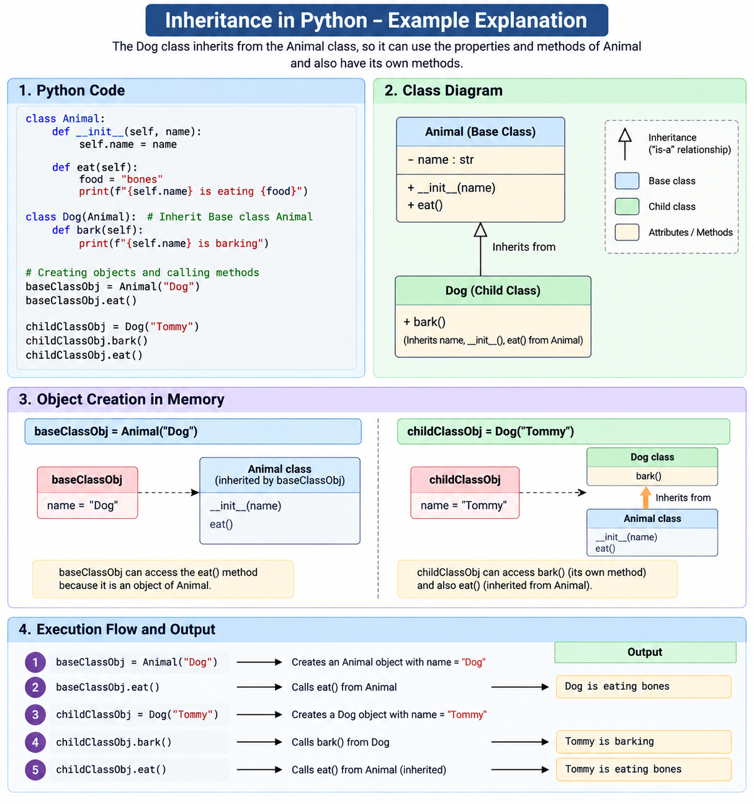
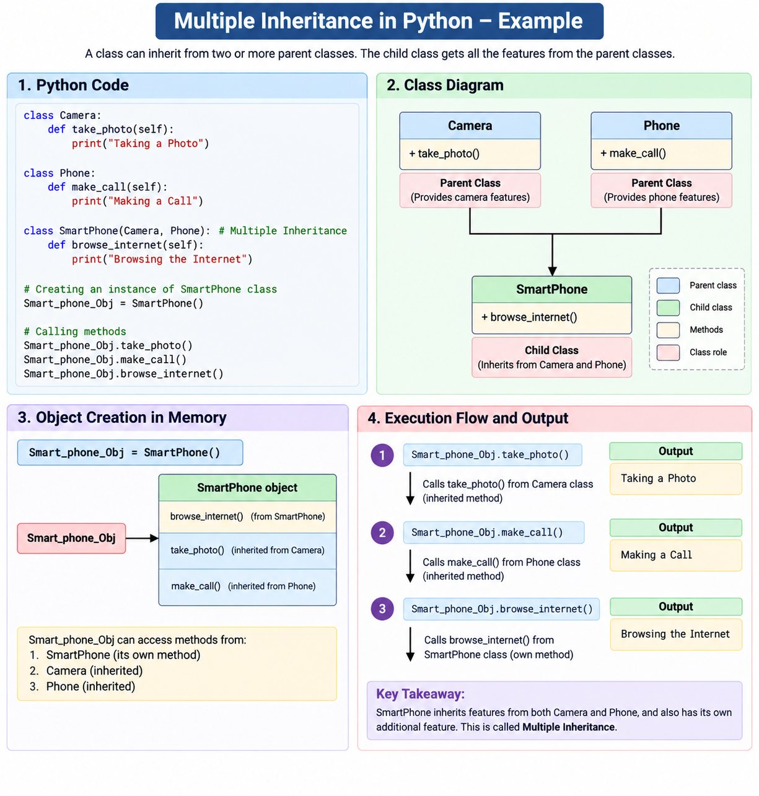
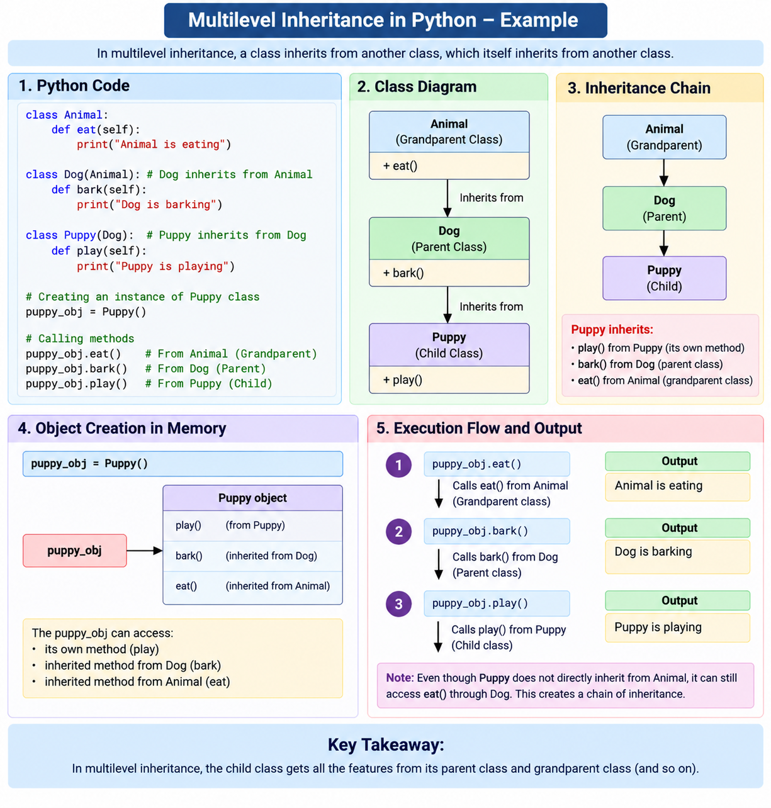
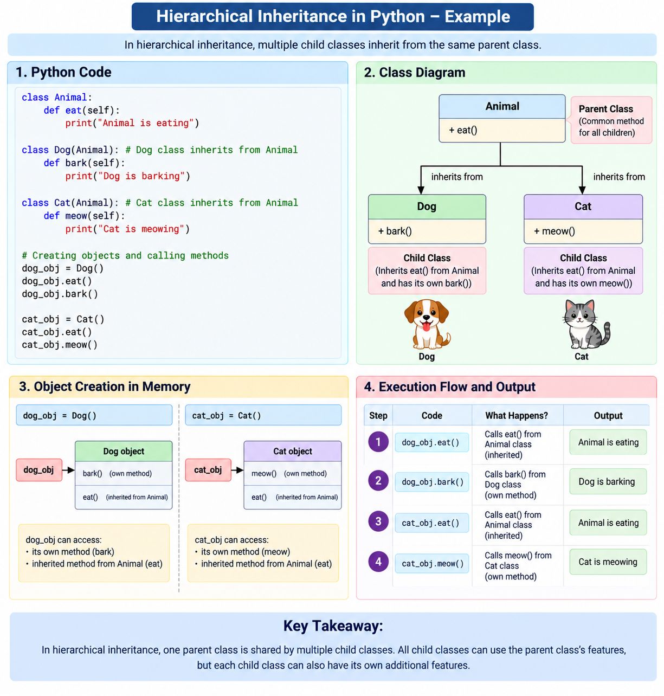
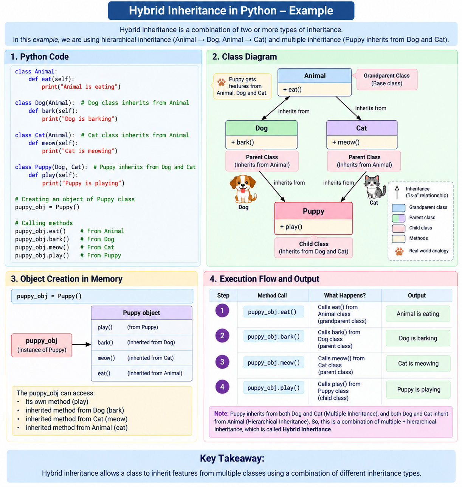

# Inheritance
Inheritance is a fundamental concept in OOP(object-oriented programming) that allows a class to inherit properties and behaviors from another class. This concept promots code reusability and the creation of a hierarchy of classes. In Python, inheritance is implemented through various types.

  
  

    <em>Inheritance</em>
  

**Types of Inheritance in Python:**
- **1) Single Inheritance:**
In single Inheritance, a class inherits from only one base class.

👉&nbsp;&nbsp;&nbsp;&nbsp;[Single-Inheritance](../Inheritance/code/Single-Inheritance.py)

  
  

    <em>Explanation</em>
  

- **2) Multiple Inheritance:**
Multiple inheritance involves a class inheriting from more than one base class. While powerful, it can lead to complexity, and care must be taken to avoid the diamond problem.

👉&nbsp;&nbsp;&nbsp;&nbsp;[Multiple-Inheritance](../Inheritance/code/Multiple-Inheritance.py)

  
  

    <em>Explanation</em>
  

- **3) Multilevel Inheritance:**

In multilevel inheritance, a class inherits from another class, and then a third class inherits from the second class.

👉&nbsp;&nbsp;&nbsp;&nbsp;[MultiLevel-Inheritance](../Inheritance/code/MultiLevel-Inheritance.py)

  
  

    <em>Explanation</em>
  

- **4) Hierarchical Inheritance:**

In hierarchical inheritance, multiple classes inherit from a common base class.

👉&nbsp;&nbsp;&nbsp;&nbsp;[Hierarchical-Inheritance](../Inheritance/code/Hierarchical-Inheritance.py)

  
  

    <em>Explanation</em>
  

- **5) Hybrid Inheritance:**

In Hybrid Inheritance, a program uses a combination of two or more types of inheritance.

👉&nbsp;&nbsp;&nbsp;&nbsp;[Hierarchical-Inheritance](../Inheritance/code/Hybrid-Inheritance.py)

  
  

    <em>Explanation</em>
  

