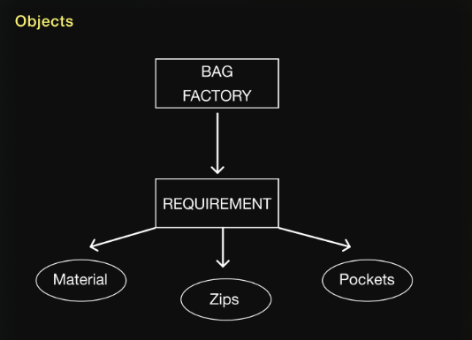
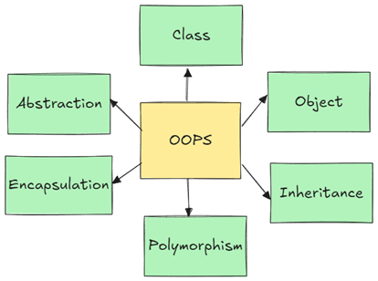

> OOPS (Object-Oriented Programming System) is a programming paradigm based on the concept of "objects", which can contain data (attributes) and code (methods).
>
> ```python
>class Addition:
>    def __init__(self, a, b):
>        print(a,b)
>obj = Addition(12,10)
>```
> I know it is tough to understand right now but it will be easy after learning there are many concepts that we have to learn like classes, objects, Encapsulation, inheritance, Polymorphism. 
>
> SO lets start....

--- 

# Classes
> A class is like a blueprint or template for creating objects. Think of a class like the blueprint of a house. It defines what the house should have (rooms, windows, etc.) but doesn't build the house. An object is the house built using that blueprint.
>
>**Syntax of class**
> 
> A class is also created with a basic keyword class and a name in front of it.
>
> ```python
>class Car:
>    brand = "BMW"
>```
> Creating a class is super simple, now lets see what inside class. There are 2 types of things inside class Attributes and Methods.
> - **Attributes:** Variables define inside the class are called Attribute.
> - **Methods:** Functions defined inside a class are called Methods
>
>```python
>class Car:
>    brand = "BMW"  #Attribute
>
>    def type(self): # Method
>        print("Automatic")
>```
> **Accessing attributes and methods**
>
> A class is initialised only one time when we first run the program and for accessing the attributes and methods we have to first access the class and then attributes and methods
>```python
>class Car:
>   type = "Auto"   # Attribute
>   
>   def gear(self): # Method
>       print("5")
># Directly access Attribute and Method using the class
>print(Car().type) # Access attribute
>Car().gear()       # Call Method
>```

---

## Objects in OOPs
<p align="center">
  <a href="./image/objects.png">
    
  </a>
  <p align="center">
    <em>Objects</em>
  </p>
</p>

>For understanding objects first look at this example you have a bag factory and that factory requires material of the bag, number of zips you need in that bag and number of pockets you need in your bag.
> - So this is a kind of a blureprint and using this blueprint Reebok, campus ans some other companies provided their requirements and created their bags.
> - Thus these companies became objects who created their bags using the blueprint.
>
>**Object syntax**
>
>- To create object you just have to call the class inside a variable and that variable becomes a class.
>- The object has all the powers of a class therefore a class onject can access attributes and methods of a class.
>```python
>class Fruit:
>    name = "Apple"
>  
># creating an object
>obj = Fruit()
>
># Accessing the attribute
>print(obj.name)
>```

---

<p align="center">
  <a href="./image/oops.png">
    
  </a>
  <p align="center">
    <em>OOPS</em>
  </p>
</p>

# Constructor

> You saw last example where we wanted material, zips and pockets from the user to create an object. If we talk about a function we can ask the user using parameters, but in class we can't have parameters for that we use constructor. 
>
> A ***constructor*** is a method that runs automatically when we call a class and this constructor function will target the `object location`. In Python, a constructor is called by the `__init__()` method, and it is invoked whenever an object is created.
> ```python
>class Student:
>   def __init__(self,name):
>       self.name = name # Instance Attribute
>
># Creating an object with a value
>obj = Student("Prakritish")
>
>#Accessing the Attribute
>print(obj.name)
>```
>To target objects location we use `self` keyword.
>
>👉&nbsp;&nbsp;&nbsp;&nbsp;[Constructor example](./code/constructor.py)
>[](./code/constructor.py)
>
>
> **Types of Attribute**
>- **class Attribute** - A normal variable created inside a class is called class Attribute.
>- **Instance Attribute** - A attribute created using an instance like `self.name`, `self.age` etc. It is known as Instance Attribute.
> ```python
>class Student:
>   subject = 5 # class Attribute
>   def __init__(self,name):
>       self.name = name # Instance Attribute
>```
> **Types of Methods**
>
>- **Instance Method** - An instance method works with instance (object) of the class. This methos can access and modify instance attributes.
>```python
>class MyClass:
>    def instance_method(self):
>        print("This is an Instance method")
>```
>- **Class Method** - This method works with the class itself it will not target the instance(object). We have to use `@classmethod` decorator for creating the class method and it takes `cls` as their first parameter
>```python
>class MyClass:
>    @classmethod
>    def class_method(cls):
>        print("This is a class method")
>```
>- **Static method** - This method doesn't access class or instance directly it also uses a decorator `@staticmethod` it just acts like a regular function placed inside a class.
>```python
>class MyClass:
>    @staticmethod
>    def static_method():
>        print("This is a static method")
>```
> **Types of Constructor**
>
> There are two types of constructors in Python:
> - 1. Default constructor
>
>The `default constructor` is a constructor that takes no arguments. It contains only one argument called self, which is a reference to the instance that is being built.
>```python
>class Details:
>    def __init__(self):
>        print("This is a default constructor")
>obj1=Details()
>#Output
>#This is a default constructor
>```
> - 2. Parameterized constructor
>
>`Parameterized constructors` are constructors that have parameters and a reference to the instance being created called `self`. The self reference serves as the first argument.
>```python
>class Details:
>    def __init__(self, name, age):
>        self.name = name
>        self.age = age
>obj1 = Details("Prakritish", "23")
>print(obj1.name, "is ", obj1.age, "years old.")
>#Output
>#Prakritish is  23 years old.
>```
  